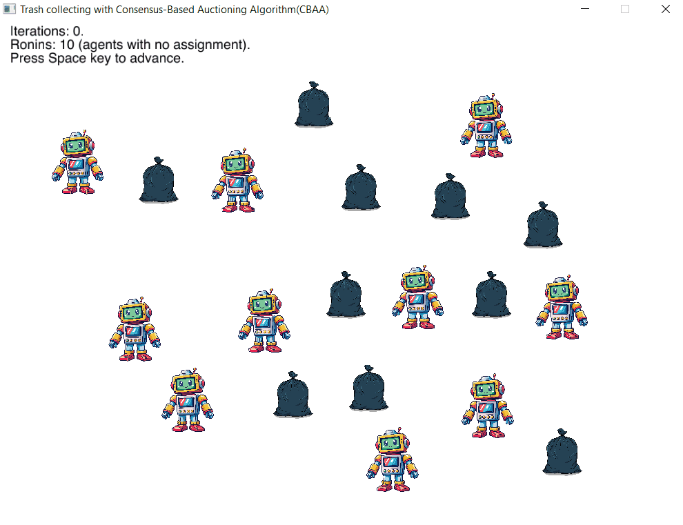
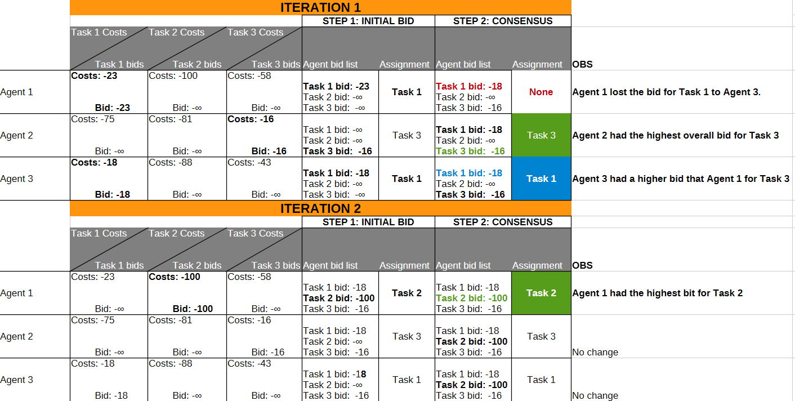

This is an example implementation of the Consensus-Based Auctioning Algorithm presented in 

[Consensus-Based Decentralized Auctions for Robust Task Allocation](https://www.semanticscholar.org/paper/Consensus-Based-Decentralized-Auctions-for-Robust-Choi-Brunet/b34aa0606626cf170118e81d11dec701598ee6d9)

## Example with 10 agents and 10 tasks
The parameters values (number of agents, number of tasks et al.) can be changed in <code>src/params.rs</code> before building.

Behind the scenes for example case with 3 Agents and 3 Tasks

## Build notes

For Rust and Cargo installation see [Rust Book: 1.Getting Started - 1.1 Installation](https://doc.rust-lang.org/cargo/getting-started/installation.html)

The crate argminmax requires the Nigthly build to be configured for the project:

<code> pip install -r requirements.txt </code>

Run with the project with:

<code> cargo run </code>
